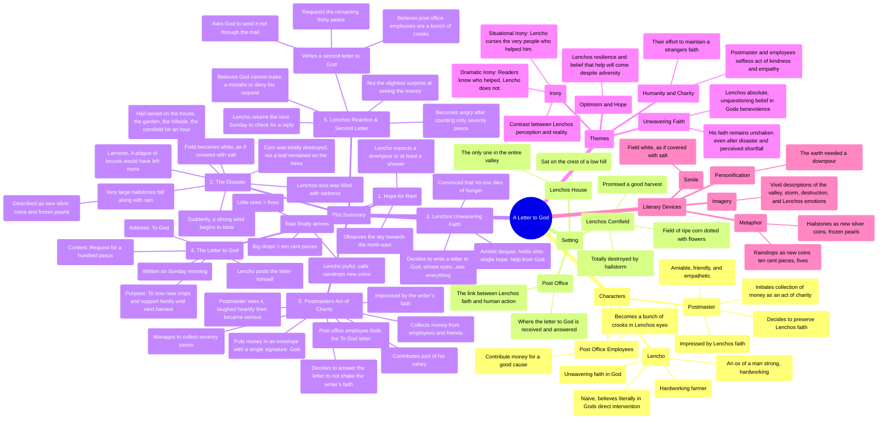

```mermaid
mindmap
  root((A Letter to God))
    (Characters)
      (Lencho)
        (Hardworking farmer)
        (Unwavering faith in God)
        (An ox of a man strong, hardworking)
        (Naive, believes literally in Gods direct intervention)
      (Postmaster)
        (Amiable, friendly, and empathetic)
        (Impressed by Lenchos faith)
        (Decides to preserve Lenchos faith)
        (Initiates collection of money as an act of charity)
      (Post Office Employees)
        (Contribute money for a good cause)
        (Becomes a bunch of crooks in Lenchos eyes)
    (Setting)
      (Lenchos House)
        (The only one in the entire valley)
        (Sat on the crest of a low hill)
      (Lenchos Cornfield)
        (Field of ripe corn dotted with flowers)
        (Promised a good harvest)
        (Totally destroyed by hailstorm)
      (Post Office)
        (The link between Lenchos faith and human action)
        (Where the letter to God is received and answered)
    (Plot Summary)
      (1. Hope for Rain)
        (Lencho expects a downpour or at least a shower)
        (Observes the sky towards the north-east)
        (Rain finally arrives)
          (Lencho joyful, calls raindrops new coins)
          (Big drops = ten cent pieces)
          (Little ones = fives)
      (2. The Disaster)
        (Suddenly, a strong wind begins to blow)
        (Very large hailstones fall along with rain)
          (Described as new silver coins and frozen pearls)
        (Hail rained on the house, the garden, the hillside, the cornfield for an hour)
        (Field becomes white, as if covered with salt)
        (Corn was totally destroyed, not a leaf remained on the trees)
        (Lenchos soul was filled with sadness)
        (Laments, A plague of locusts would have left more)
      (3. Lenchos Unwavering Faith)
        (Amidst despair, holds onto single hope: help from God)
        (Convinced that no one dies of hunger)
        (Decides to write a letter to God, whose eyes...see everything)
      (4. The Letter to God)
        (Written on Sunday morning)
        (Address: To God)
        (Content: Request for a hundred pesos)
        (Purpose: To sow new crops and support family until next harvest)
        (Lencho posts the letter himself)
      (5. Postmasters Act of Charity)
        (Post office employee finds the To God letter)
        (Postmaster sees it, laughed heartily then became serious)
        (Impressed by the writer’s faith)
        (Decides to answer the letter to not shake the writer’s faith)
        (Collects money from employees and friends)
        (Contributes part of his salary)
        (Manages to collect seventy pesos)
        (Puts money in an envelope with a single signature: God)
      (6. Lenchos Reaction & Second Letter)
        (Lencho returns the next Sunday to check for a reply)
        (Not the slightest surprise at seeing the money)
        (Becomes angry after counting only seventy pesos)
        (Believes God cannot make a mistake or deny his request)
        (Writes a second letter to God)
          (Requests the remaining thirty pesos)
          (Asks God to send it not through the mail)
          (Believes post office employees are a bunch of crooks)
    (Themes)
      (Unwavering Faith)
        (Lenchos absolute, unquestioning belief in Gods benevolence)
        (His faith remains unshaken even after disaster and perceived shortfall)
      (Humanity and Charity)
        (Postmaster and employees selfless act of kindness and empathy)
        (Their effort to maintain a strangers faith)
      (Irony)
        (Dramatic Irony: Readers know who helped, Lencho does not.)
        (Situational Irony: Lencho curses the very people who helped him.)
        (Contrast between Lenchos perception and reality.)
      (Optimism and Hope)
        (Lenchos resilience and belief that help will come despite adversity)
    (Literary Devices)
      (Metaphor)
        (Raindrops as new coins ten cent pieces, fives)
        (Hailstones as new silver coins, frozen pearls)
      (Simile)
        (Field white, as if covered with salt)
      (Imagery)
        (Vivid descriptions of the valley, storm, destruction, and Lenchos emotions)
      (Personification)
        (The earth needed a downpour)
```
