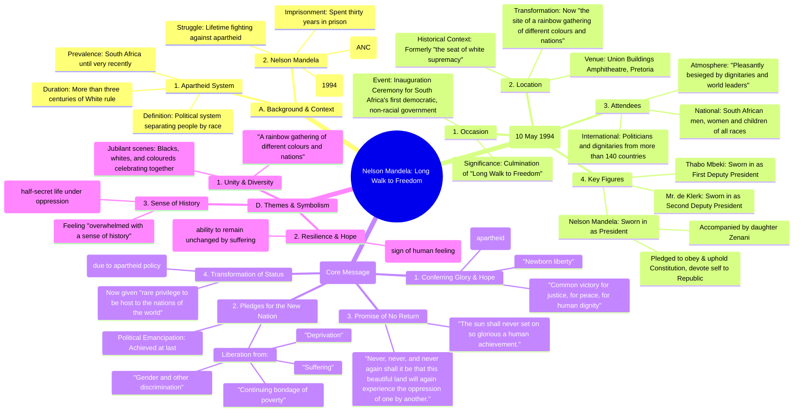

```mermaid
mindmap
  root((Nelson Mandela: Long Walk to Freedom))
    A. Background & Context
      1. Apartheid System
        Definition: Political system separating people by race
        Prevalence: South Africa until very recently
        Duration: More than three centuries of White rule
      2. Nelson Mandela
        Struggle: Lifetime fighting against apartheid
        Party: African National Congress (ANC)
        Imprisonment: Spent thirty years in prison
        Achievement: Became South Africa's First Black President (1994)
    B. The Historic Inauguration (10 May 1994)
      1. Occasion
        Event: Inauguration Ceremony for South Africa's first democratic, non-racial government
        Significance: Culmination of "Long Walk to Freedom"
      2. Location
        Venue: Union Buildings Amphitheatre, Pretoria
        Historical Context: Formerly "the seat of white supremacy"
        Transformation: Now "the site of a rainbow gathering of different colours and nations"
      3. Attendees
        International: Politicians and dignitaries from more than 140 countries
        National: South African men, women and children of all races
        Atmosphere: "Pleasantly besieged by dignitaries and world leaders"
      4. Key Figures
        Nelson Mandela: Sworn in as President
          Accompanied by daughter Zenani
          Pledged to obey & uphold Constitution, devote self to Republic
        Mr. de Klerk: Sworn in as Second Deputy President
        Thabo Mbeki: Sworn in as First Deputy President
    C. Mandela's Inaugural Address (Core Message)
      1. Conferring Glory & Hope
        "Newborn liberty"
        Out of "an extraordinary human disaster" (apartheid)
        "Common victory for justice, for peace, for human dignity"
      2. Pledges for the New Nation
        Political Emancipation: Achieved at last
        Liberation from:
          "Continuing bondage of poverty"
          "Deprivation"
          "Suffering"
          "Gender and other discrimination"
      3. Promise of No Return
        "Never, never, and never again shall it be that this beautiful land will again experience the oppression of one by another."
        "The sun shall never set on so glorious a human achievement."
      4. Transformation of Status
        Former "outlaws" (due to apartheid policy)
        Now given "rare privilege to be host to the nations of the world"
    D. Themes & Symbolism
      1. Unity & Diversity
        "A rainbow gathering of different colours and nations"
        Jubilant scenes: Blacks, whites, and coloureds celebrating together
      2. Resilience & Hope
        "Resilience that defies the imagination" (ability to remain unchanged by suffering)
        "A glimmer of humanity" (sign of human feeling)
      3. Sense of History
        Feeling "overwhelmed with a sense of history"
        End of "a twilight existence" (half-secret life under oppression)
```