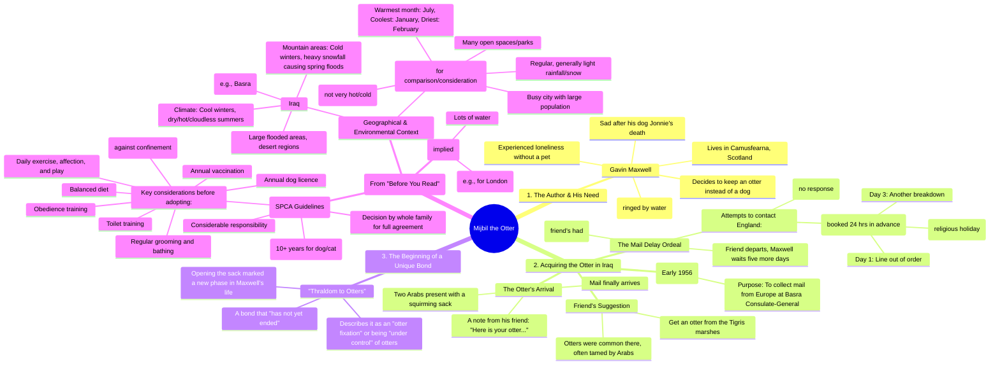

```mermaid
mindmap
  root((Mijbil the Otter))
    1. The Author & His Need
      Gavin Maxwell
        Lives in Camusfearna, Scotland
        Sad after his dog Jonnie's death
        Experienced loneliness without a pet
        Decides to keep an otter instead of a dog
        Considers Camusfearna suitable (ringed by water)

    2. Acquiring the Otter in Iraq
      Journey to Southern Iraq (Early 1956)
        Purpose: To collect mail from Europe at Basra Consulate-General
      Friend's Suggestion
        Get an otter from the Tigris marshes
        Otters were common there, often tamed by Arabs
      The Mail Delay Ordeal
        Maxwell's mail not yet arrived (friend's had)
        Attempts to contact England:
          Cabled (no response)
          Tried to telephone (booked 24 hrs in advance)
            Day 1: Line out of order
            Day 2: Exchange closed (religious holiday)
            Day 3: Another breakdown
        Friend departs, Maxwell waits five more days
      The Otter's Arrival
        Mail finally arrives
        Two Arabs present with a squirming sack
        A note from his friend: "Here is your otter..."

    3. The Beginning of a Unique Bond
      "Thraldom to Otters"
        Opening the sack marked a new phase in Maxwell's life
        Describes it as an "otter fixation" or being "under control" of otters
        A bond that "has not yet ended"

    4. Contextual Information (From "Before You Read")
      Pet Ownership Responsibility (SPCA Guidelines)
        Lifetime commitment (10+ years for dog/cat)
        Considerable responsibility
        Decision by whole family for full agreement
        Key considerations before adopting:
          Annual dog licence
          Annual vaccination
          Toilet training
          Regular grooming and bathing
          Obedience training
          Balanced diet
          Socialisation (against confinement)
          Daily exercise, affection, and play
      Geographical & Environmental Context
        Iraq
          Southern Iraq: Broad plains and marshes (e.g., Basra)
          Large flooded areas, desert regions
          Climate: Cool winters, dry/hot/cloudless summers
          Mountain areas: Cold winters, heavy snowfall causing spring floods
        London (for comparison/consideration)
          Busy city with large population
          Many open spaces/parks
          Temperate climate (not very hot/cold)
          Regular, generally light rainfall/snow
          Warmest month: July, Coolest: January, Driest: February
      Otter Habitat Needs (implied)
        Lots of water
        Suitable environment beyond Basra marshes (e.g., for London)
```