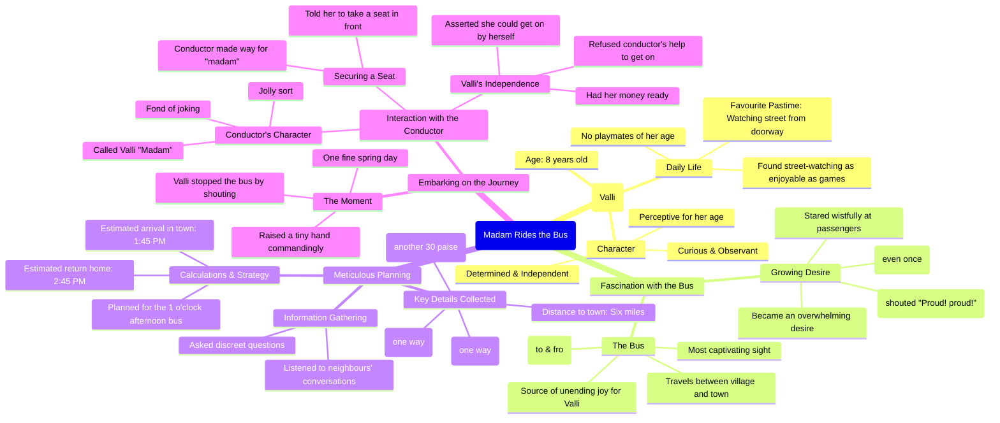

```mermaid
mindmap
  root(Madam Rides the Bus)
    Valliammai (Valli)
      Age: 8 years old
      Character
        Curious & Observant
        Determined & Independent
        Perceptive for her age
      Daily Life
        Favourite Pastime: Watching street from doorway
        No playmates of her age
        Found street-watching as enjoyable as games
    Fascination with the Bus
      The Bus
        Most captivating sight
        Travels between village and town
        Passes through street hourly (to & fro)
        Source of unending joy for Valli
      Growing Desire
        Wish to ride the bus (even once)
        Became an overwhelming desire
        Stared wistfully at passengers
        Jealous of friends (shouted "Proud! proud!")
    Meticulous Planning
      Information Gathering
        Listened to neighbours' conversations
        Asked discreet questions
      Key Details Collected
        Distance to town: Six miles
        Bus Fare: 30 paise (one way)
        Journey Duration: 45 minutes (one way)
        Return possible on same bus (another 30 paise)
      Calculations & Strategy
        Planned for the 1 o'clock afternoon bus
        Estimated arrival in town: 1:45 PM
        Estimated return home: 2:45 PM
    Embarking on the Journey
      The Moment
        One fine spring day
        Valli stopped the bus by shouting
        Raised a tiny hand commandingly
      Interaction with the Conductor
        Conductor's Character
          Jolly sort
          Fond of joking
          Called Valli "Madam"
        Valli's Independence
          Refused conductor's help to get on
          Asserted she could get on by herself
          Had her money ready
        Securing a Seat
          Conductor made way for "madam"
          Told her to take a seat in front
```