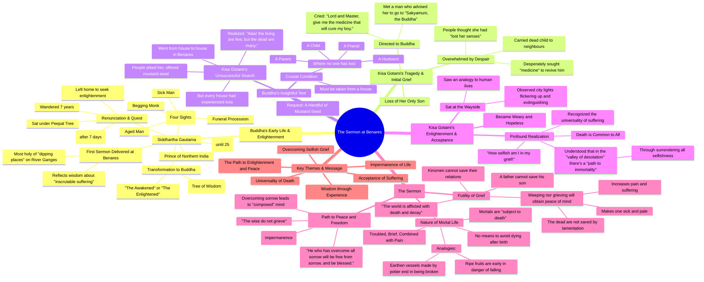

```mermaid
mindmap
  root((The Sermon at Benares))
    Buddha's Early Life & Enlightenment
      Siddhartha Gautama
        Prince of Northern India
        Sheltered Life (until 25)
        Witnessed Suffering (Four Sights)
          Sick Man
          Aged Man
          Funeral Procession
          Begging Monk
        Renunciation & Quest
          Left home to seek enlightenment
          Wandered 7 years
          Sat under Peepal Tree
          Achieved Enlightenment (after 7 days)
        Transformation to Buddha
          "The Awakened" or "The Enlightened"
          Peepal Tree renamed Bodhi Tree (Tree of Wisdom)
        First Sermon Delivered at Benares
          Most holy of "dipping places" on River Ganges
          Reflects wisdom about "inscrutable suffering"

    Kisa Gotami's Tragedy & Initial Grief
      Loss of Her Only Son
      Overwhelmed by Despair
        Carried dead child to neighbours
        Desperately sought "medicine" to revive him
        People thought she had "lost her senses"
      Directed to Buddha
        Met a man who advised her to go to "Sakyamuni, the Buddha"
        Cried: "Lord and Master, give me the medicine that will cure my boy."

    Buddha's Insightful Test
      Request: A Handful of Mustard-Seed
      Crucial Condition
        Must be taken from a house
        Where no one has lost:
          A Child
          A Husband
          A Parent
          A Friend
      Kisa Gotami's Unsuccessful Search
        Went from house to house in Benares
        People pitied her, offered mustard-seed
        But every house had experienced loss
        Realized: "Alas! the living are few, but the dead are many."

    Kisa Gotami's Enlightenment & Acceptance
      Became Weary and Hopeless
      Sat at the Wayside
        Observed city lights flickering up and extinguishing
        Saw an analogy to human lives
      Profound Realization
        "How selfish am I in my grief!"
        Death is Common to All
        Recognized the universality of suffering
        Understood that in the "valley of desolation" there's a "path to immortality"
          Through surrendering all selfishness

    Buddha's Core Teachings (The Sermon)
      Nature of Mortal Life
        Troubled, Brief, Combined with Pain
        No means to avoid dying after birth
        Mortals are "subject to death"
        Analogies:
          Ripe fruits are early in danger of falling
          Earthen vessels made by potter end in being broken
      Futility of Grief
        A father cannot save his son
        Kinsmen cannot save their relations
        "The world is afflicted with death and decay"
        Weeping nor grieving will obtain peace of mind
          Increases pain and suffering
          Makes one sick and pale
          The dead are not saved by lamentation
      Path to Peace and Freedom
        "The wise do not grieve"
        Knowing the "terms of the world" (impermanence)
        Overcoming sorrow leads to "composed" mind
        "He who has overcome all sorrow will be free from sorrow, and be blessed."

    Key Themes & Message
      Universality of Death
      Impermanence of Life
      Acceptance of Suffering
      Wisdom through Experience
      Overcoming Selfish Grief
      The Path to Enlightenment and Peace
```