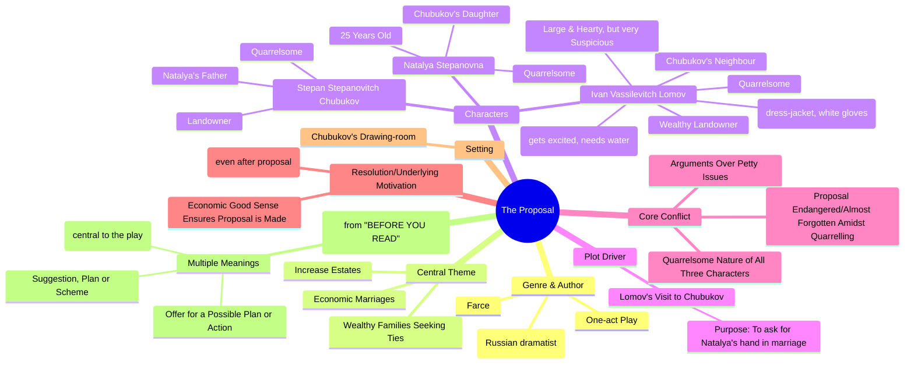

```mermaid
mindmap
  root((The Proposal))
    Genre & Author
      One-act Play
      Farce
      Anton Chekhov (Russian dramatist)
    Central Theme
      Economic Marriages
      Wealthy Families Seeking Ties
      Increase Estates
    Characters
      Stepan Stepanovitch Chubukov
        Landowner
        Natalya's Father
        Quarrelsome
      Natalya Stepanovna
        Chubukov's Daughter
        25 Years Old
        Quarrelsome
      Ivan Vassilevitch Lomov
        Chubukov's Neighbour
        Wealthy Landowner
        Large & Hearty, but very Suspicious
        Easily Excited (gets excited, needs water)
        Formal Attire (dress-jacket, white gloves)
        Quarrelsome
    Plot Driver
      Lomov's Visit to Chubukov
        Purpose: To ask for Natalya's hand in marriage
    Core Conflict
      Quarrelsome Nature of All Three Characters
      Arguments Over Petty Issues
      Proposal Endangered/Almost Forgotten Amidst Quarrelling
    Resolution/Underlying Motivation
      Economic Good Sense Ensures Proposal is Made
      Quarrelling Continues (even after proposal)
    Setting
      Chubukov's Drawing-room
    Concept of 'Proposal' (from "BEFORE YOU READ")
      Multiple Meanings
        Suggestion, Plan or Scheme
        Offer for a Possible Plan or Action
        Act of Asking Someone's Hand in Marriage (central to the play)
```