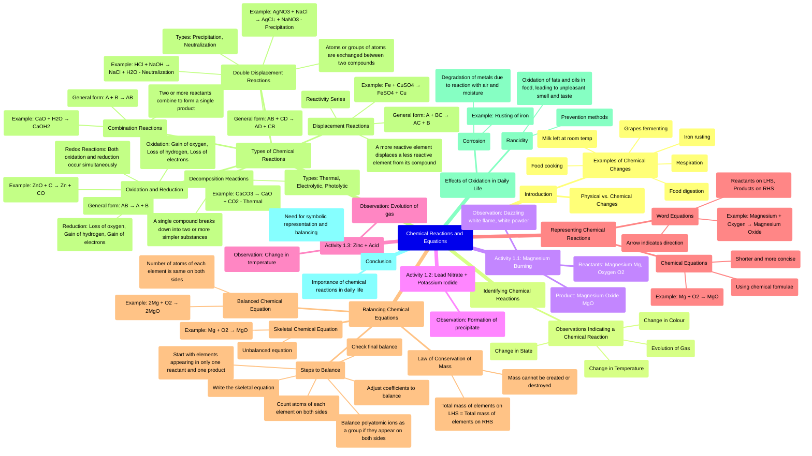

```mermaid
mindmap
  root(Chemical Reactions and Equations)
    (Introduction)
      (Physical vs. Chemical Changes)
      (Examples of Chemical Changes)
        (Milk left at room temp)
        (Iron rusting)
        (Grapes fermenting)
        (Food cooking)
        (Food digestion)
        (Respiration)
    (Identifying Chemical Reactions)
      (Observations Indicating a Chemical Reaction)
        (Change in State)
        (Change in Colour)
        (Evolution of Gas)
        (Change in Temperature)
    (Activity 1.1: Magnesium Burning)
      (Observation: Dazzling white flame, white powder)
      (Product: Magnesium Oxide MgO)
      (Reactants: Magnesium Mg, Oxygen O2)
    (Activity 1.2: Lead Nitrate + Potassium Iodide)
      (Observation: Formation of precipitate)
    (Activity 1.3: Zinc + Acid)
      (Observation: Evolution of gas)
      (Observation: Change in temperature)
    (Representing Chemical Reactions)
      (Word Equations)
        (Reactants on LHS, Products on RHS)
        (Arrow indicates direction)
        (Example: Magnesium + Oxygen → Magnesium Oxide)
      (Chemical Equations)
        (Using chemical formulae)
        (Shorter and more concise)
        (Example: Mg + O2 → MgO)
    (Balancing Chemical Equations)
      (Law of Conservation of Mass)
        (Mass cannot be created or destroyed)
        (Total mass of elements on LHS = Total mass of elements on RHS)
      (Skeletal Chemical Equation)
        (Unbalanced equation)
        (Example: Mg + O2 → MgO)
      (Balanced Chemical Equation)
        (Number of atoms of each element is same on both sides)
        (Example: 2Mg + O2 → 2MgO)
      (Steps to Balance)
        (Write the skeletal equation)
        (Count atoms of each element on both sides)
        (Adjust coefficients to balance)
        (Start with elements appearing in only one reactant and one product)
        (Balance polyatomic ions as a group if they appear on both sides)
        (Check final balance)
    (Types of Chemical Reactions)
      (Combination Reactions)
        (Two or more reactants combine to form a single product)
        (General form: A + B → AB)
        (Example: CaO + H2O → CaOH2)
      (Decomposition Reactions)
        (A single compound breaks down into two or more simpler substances)
        (General form: AB → A + B)
        (Types: Thermal, Electrolytic, Photolytic)
        (Example: CaCO3 → CaO + CO2 - Thermal)
      (Displacement Reactions)
        (A more reactive element displaces a less reactive element from its compound)
        (General form: A + BC → AC + B)
        (Reactivity Series)
        (Example: Fe + CuSO4 → FeSO4 + Cu)
      (Double Displacement Reactions)
        (Atoms or groups of atoms are exchanged between two compounds)
        (General form: AB + CD → AD + CB)
        (Types: Precipitation, Neutralization)
        (Example: AgNO3 + NaCl → AgCl↓ + NaNO3 - Precipitation)
        (Example: HCl + NaOH → NaCl + H2O - Neutralization)
      (Oxidation and Reduction)
        (Oxidation: Gain of oxygen, Loss of hydrogen, Loss of electrons)
        (Reduction: Loss of oxygen, Gain of hydrogen, Gain of electrons)
        (Redox Reactions: Both oxidation and reduction occur simultaneously)
        (Example: ZnO + C → Zn + CO)
    (Effects of Oxidation in Daily Life)
      (Corrosion)
        (Degradation of metals due to reaction with air and moisture)
        (Example: Rusting of iron)
      (Rancidity)
        (Oxidation of fats and oils in food, leading to unpleasant smell and taste)
        (Prevention methods)
    (Conclusion)
      (Importance of chemical reactions in daily life)
      (Need for symbolic representation and balancing)
```
