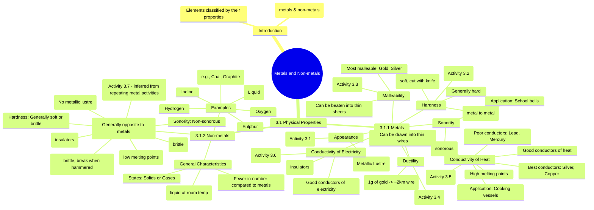

```mermaid
mindmap
  root((Metals and Non-metals))
    Introduction
      Elements classified by their properties
      Uses in daily life (metals & non-metals)
    3.1 Physical Properties
      3.1.1 Metals
        Appearance
          Shining surface (Metallic Lustre)
          (Activity 3.1)
        Hardness
          Generally hard
          Hardness varies (metal to metal)
          Exception: Sodium (soft, cut with knife)
          (Activity 3.2)
        Malleability
          Can be beaten into thin sheets
          Most malleable: Gold, Silver
          (Activity 3.3)
        Ductility
          Can be drawn into thin wires
          Most ductile: Gold (1g of gold -> ~2km wire)
          (Activity 3.4)
        Conductivity of Heat
          Good conductors of heat
          High melting points
          Best conductors: Silver, Copper
          Poor conductors: Lead, Mercury
          Application: Cooking vessels
          (Activity 3.5)
        Conductivity of Electricity
          Good conductors of electricity
          Wires coated with PVC/rubber (insulators)
          (Activity 3.6)
        Sonority
          Produce sound on striking hard surface (sonorous)
          Application: School bells
      3.1.2 Non-metals
        General Characteristics
          Fewer in number compared to metals
          States: Solids or Gases
          Exception: Bromine (liquid at room temp)
        Physical Properties (Generally opposite to metals)
          Appearance: Dull (No metallic lustre)
          Hardness: Generally soft or brittle
          Malleability: Not malleable (brittle, break when hammered)
          Ductility: Not ductile (brittle)
          Conductivity of Heat: Poor conductors of heat (low melting points)
          Conductivity of Electricity: Poor conductors of electricity (insulators)
          Sonority: Non-sonorous
          (Activity 3.7 - inferred from repeating metal activities)
        Examples
          Carbon (e.g., Coal, Graphite)
          Sulphur
          Iodine
          Oxygen
          Hydrogen
          Bromine (Liquid)
```