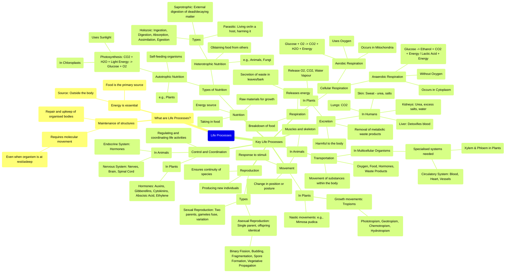

```mermaid
mindmap
  root(Life Processes)
    (What are Life Processes?)
      ::icon(fa fa-question-circle)
      (Maintenance of structures)
        (Repair and upkeep of organised bodies)
        (Requires molecular movement)
          (Even when organism is at rest/asleep)
      (Energy is essential)
        (Source: Outside the body)
        (Food is the primary source)
    (Key Life Processes)
      (Nutrition)
        ::icon(fa fa-utensils)
        (Taking in food)
        (Raw materials for growth)
        (Energy source)
        (Types of Nutrition)
          (Autotrophic Nutrition)
            (Self-feeding organisms)
            (e.g., Plants)
            (Photosynthesis: CO2 + H2O + Light Energy -> Glucose + O2)
              (In Chloroplasts)
              (Uses Sunlight)
          (Heterotrophic Nutrition)
            (Obtaining food from others)
            (e.g., Animals, Fungi)
            (Types)
              (Holozoic: Ingestion, Digestion, Absorption, Assimilation, Egestion)
              (Saprotrophic: External digestion of dead/decaying matter)
              (Parasitic: Living on/in a host, harming it)
      (Respiration)
        ::icon(fa fa-lungs)
        (Breakdown of food)
        (Releases energy)
        (Cellular Respiration)
          (Aerobic Respiration)
            (Uses Oxygen)
            (Glucose + O2 -> CO2 + H2O + Energy)
            (Occurs in Mitochondria)
          (Anaerobic Respiration)
            (Without Oxygen)
            (Glucose -> Ethanol + CO2 + Energy / Lactic Acid + Energy)
            (Occurs in Cytoplasm)
      (Transportation)
        ::icon(fa fa-truck)
        (Movement of substances within the body)
        (Oxygen, Food, Hormones, Waste Products)
        (In Multicellular Organisms)
          (Specialised systems needed)
            (Circulatory System: Blood, Heart, Vessels)
            (Xylem & Phloem in Plants)
      (Excretion)
        ::icon(fa fa-toilet-paper)
        (Removal of metabolic waste products)
        (Harmful to the body)
        (In Humans)
          (Kidneys: Urea, excess salts, water)
          (Lungs: CO2)
          (Skin: Sweat - urea, salts)
          (Liver: Detoxifies blood)
        (In Plants)
          (Release O2, CO2, Water Vapour)
          (Secretion of waste in leaves/bark)
      (Movement)
        ::icon(fa fa-running)
        (Change in position or posture)
        (Response to stimuli)
        (In Animals)
          (Muscles and skeleton)
        (In Plants)
          (Growth movements: Tropisms)
            (Phototropism, Geotropism, Chemotropism, Hydrotropism)
          (Nastic movements: e.g., Mimosa pudica)
      (Control and Coordination)
        ::icon(fa fa-brain)
        (Regulating and coordinating life activities)
        (In Animals)
          (Nervous System: Nerves, Brain, Spinal Cord)
          (Endocrine System: Hormones)
        (In Plants)
          (Hormones: Auxins, Gibberellins, Cytokinins, Abscisic Acid, Ethylene)
      (Reproduction)
        ::icon(fa fa-dna)
        (Producing new individuals)
        (Ensures continuity of species)
        (Types)
          (Asexual Reproduction: Single parent, offspring identical)
            (Binary Fission, Budding, Fragmentation, Spore Formation, Vegetative Propagation)
          (Sexual Reproduction: Two parents, gametes fuse, variation)
```