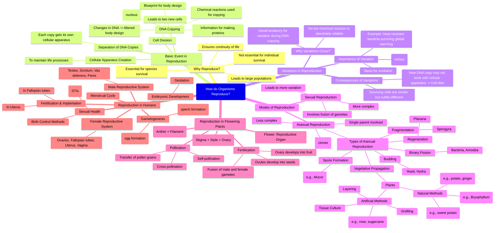

```mermaid
mindmap
  root(How do Organisms Reproduce?)
    Why Reproduce?
      ::icon(fa fa-question-circle)
      Not essential for individual survival
      Essential for species survival
      Ensures continuity of life
      Leads to large populations
    Basic Event in Reproduction
      ::icon(fa fa-dna)
      DNA Copying
        ::icon(fa fa-copy)
        Blueprint for body design
        Located in chromosomes (nucleus)
        Information for making proteins
        Changes in DNA -> Altered body design
        Chemical reactions used for copying
      Cellular Apparatus Creation
        ::icon(fa fa-microscope)
        To maintain life processes
      Separation of DNA Copies
        ::icon(fa fa-arrows-alt-h)
        Each copy gets its own cellular apparatus
      Cell Division
        ::icon(fa fa-divide)
        Leads to two new cells
    Variations in Reproduction
      ::icon(fa fa-random)
      Why Variations Occur?
        ::icon(fa fa-exclamation-triangle)
        No bio-chemical reaction is absolutely reliable
        Inbuilt tendency for variation during DNA copying
      Consequences of Variations
        ::icon(fa fa-leaf)
        New DNA copy may not work with cellular apparatus -> Cell dies
        Surviving cells are similar but subtly different
      Importance of Variation
        ::icon(fa fa-seedling)
        Basis for evolution
        Survival of species in changing environments (niches)
        Example: Heat-resistant bacteria surviving global warming
    Modes of Reproduction
      ::icon(fa fa-sitemap)
      Sexual Reproduction
        ::icon(fa fa-venus-mars)
        Involves fusion of gametes
        Leads to more variation
        More complex
      Asexual Reproduction
        ::icon(fa fa-unlink)
        Single parent involved
        Offspring are genetically identical (clones)
        Less complex
        Types of Asexual Reproduction
          ::icon(fa fa-list-ol)
          Binary Fission
            ::icon(fa fa-bacteria)
            Bacteria, Amoeba
          Budding
            ::icon(fa fa-gift)
            Yeast, Hydra
          Fragmentation
            ::icon(fa fa-cut)
            Spirogyra
          Regeneration
            ::icon(fa fa-plus-circle)
            Planaria
          Spore Formation
            ::icon(fa fa-mold)
            Fungi (e.g., Mucor)
          Vegetative Propagation
            ::icon(fa fa-leaf-heart)
            Plants
              ::icon(fa fa-apple-alt)
              Natural Methods
                ::icon(fa fa-root-close)
                Roots (e.g., sweet potato)
                ::icon(fa fa-leaf-alt)
                Stems (e.g., potato, ginger)
                ::icon(fa fa-bud)
                Leaves (e.g., Bryophyllum)
              ::icon(fa fa-syringe)
              Artificial Methods
                ::icon(fa fa-cut)
                Cutting (e.g., rose, sugarcane)
                ::icon(fa fa-layer-group)
                Layering
                ::icon(fa fa-graft)
                Grafting
                ::icon(fa fa-culture)
                Tissue Culture
    Reproduction in Flowering Plants
      ::icon(fa fa-flower)
      Flower: Reproductive Organ
      Male Part: Stamen (Anther + Filament)
      Female Part: Pistil/Carpel (Stigma + Style + Ovary)
      Pollination
        ::icon(fa fa-wind)
        Transfer of pollen grains
        Self-pollination
        Cross-pollination
      Fertilization
        ::icon(fa fa-ring)
        Fusion of male and female gametes
        Ovary develops into fruit
        Ovules develop into seeds
    Reproduction in Humans
      ::icon(fa fa-male-female)
      Male Reproductive System
        ::icon(fa fa-person-male)
        Testes, Scrotum, Vas deferens, Penis
      Female Reproductive System
        ::icon(fa fa-person-female)
        Ovaries, Fallopian tubes, Uterus, Vagina
      Gametogenesis
        ::icon(fa fa-microscope)
        Spermatogenesis (sperm formation)
        Oogenesis (egg formation)
      Menstrual Cycle
        ::icon(fa fa-calendar-alt)
      Fertilization & Implantation
        ::icon(fa fa-star)
        In Fallopian tubes
        In Uterus
      Embryonic Development
        ::icon(fa fa-baby)
        Gestation
      Sexual Health
        ::icon(fa fa-shield-alt)
        Sexually Transmitted Infections (STIs)
        Birth Control Methods
```