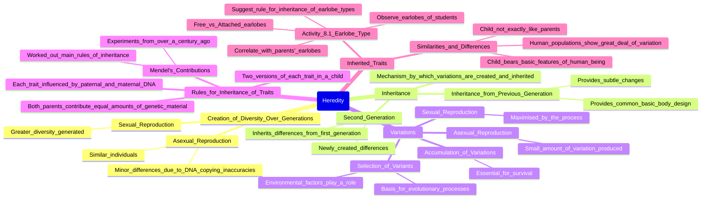

```mermaid
mindmap
  root(Heredity)
    Creation_of_Diversity_Over_Generations
      Asexual_Reproduction
        Similar_individuals
        Minor_differences_due_to_DNA_copying_inaccuracies
      Sexual_Reproduction
        Greater_diversity_generated
    Inheritance
      Mechanism_by_which_variations_are_created_and_inherited
      Inheritance_from_Previous_Generation
        Provides_common_basic_body_design
        Provides_subtle_changes
      Second_Generation
        Inherits_differences_from_first_generation
        Newly_created_differences
    Variations
      Asexual_Reproduction
        Small_amount_of_variation_produced
      Sexual_Reproduction
        Maximised_by_the_process
      Accumulation_of_Variations
        Essential_for_survival
      Selection_of_Variants
        Environmental_factors_play_a_role
        Basis_for_evolutionary_processes
    Rules_for_Inheritance_of_Traits
      Both_parents_contribute_equal_amounts_of_genetic_material
      Each_trait_influenced_by_paternal_and_maternal_DNA
      Two_versions_of_each_trait_in_a_child
      Mendel's_Contributions
        Worked_out_main_rules_of_inheritance
        Experiments_from_over_a_century_ago
    Inherited_Traits
      Similarities_and_Differences
        Child_bears_basic_features_of_human_being
        Child_not_exactly_like_parents
        Human_populations_show_great_deal_of_variation
      Activity_8.1_Earlobe_Type
        Observe_earlobes_of_students
        Free_vs_Attached_earlobes
        Correlate_with_parents'_earlobes
        Suggest_rule_for_inheritance_of_earlobe_types
```