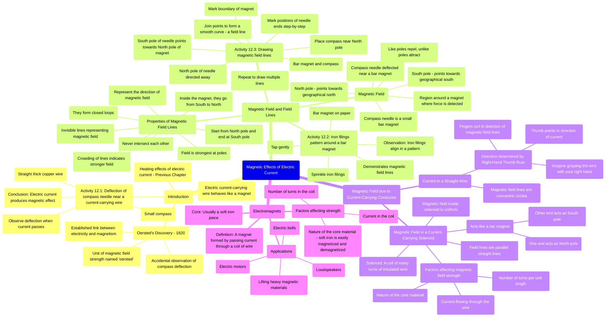

```mermaid
mindmap
  root(Magnetic Effects of Electric Current)
    (Introduction)
      (Heating effects of electric current - Previous Chapter)
      (Electric current-carrying wire behaves like a magnet)
      (Activity 12.1: Deflection of compass needle near a current-carrying wire)
        (Straight thick copper wire)
        (Small compass)
        (Observe deflection when current passes)
        (Conclusion: Electric current produces magnetic effect)
      (Oersted's Discovery - 1820)
        (Accidental observation of compass deflection)
        (Established link between electricity and magnetism)
        (Unit of magnetic field strength named 'oersted')
    (Magnetic Field and Field Lines)
      (Magnetic Field)
        (Region around a magnet where force is detected)
        (Compass needle deflected near a bar magnet)
        (Compass needle is a small bar magnet)
        (North pole - points towards geographical north)
        (South pole - points towards geographical south)
        (Like poles repel, unlike poles attract)
      (Activity 12.2: Iron filings pattern around a bar magnet)
        (Bar magnet on paper)
        (Sprinkle iron filings)
        (Tap gently)
        (Observation: Iron filings align in a pattern)
        (Demonstrates magnetic field lines)
      (Activity 12.3: Drawing magnetic field lines)
        (Bar magnet and compass)
        (Mark boundary of magnet)
        (Place compass near North pole)
        (South pole of needle points towards North pole of magnet)
        (North pole of needle directed away)
        (Mark positions of needle ends step-by-step)
        (Join points to form a smooth curve - a field line)
        (Repeat to draw multiple lines)
      (Properties of Magnetic Field Lines)
        (Invisible lines representing magnetic field)
        (Represent the direction of magnetic field)
        (Start from North pole and end at South pole)
        (Inside the magnet, they go from South to North)
        (They form closed loops)
        (Never intersect each other)
        (Crowding of lines indicates stronger field)
        (Field is strongest at poles)
    (Magnetic Field due to Current-Carrying Conductor)
      (Current in a Straight Wire)
        (Magnetic field lines are concentric circles)
        (Direction determined by Right-Hand Thumb Rule)
          (Imagine gripping the wire with your right hand)
          (Thumb points in direction of current)
          (Fingers curl in direction of magnetic field lines)
      (Magnetic Field in a Current-Carrying Solenoid)
        (Solenoid: A coil of many turns of insulated wire)
        (Magnetic field inside solenoid is uniform)
        (Field lines are parallel straight lines)
        (Acts like a bar magnet)
          (One end acts as North pole)
          (Other end acts as South pole)
        (Factors affecting magnetic field strength)
          (Number of turns per unit length)
          (Current flowing through the wire)
          (Nature of the core material)
    (Electromagnets)
      (Definition: A magnet formed by passing current through a coil of wire)
      (Core: Usually a soft iron piece)
      (Factors affecting strength)
        (Current in the coil)
        (Number of turns in the coil)
        (Nature of the core material - soft iron is easily magnetized and demagnetized)
      (Applications)
        (Electric bells)
        (Electric motors)
        (Loudspeakers)
        (Lifting heavy magnetic materials)
```